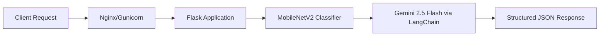

# Indonesian Food Classification Service

A production-grade Flask API that combines Computer Vision and Large Language Models (LLMs) to classify Indonesian cuisine and generate structured culinary data. The service utilizes a MobileNetV2 architecture for image inference and Google Gemini 1.5 Flash for dynamic recipe orchestration.

## System Architecture



## Technical Specifications

### Core Engine
- **Inference Model**: MobileNetV2 (Transfer Learning)
- **Generative Model**: Gemini 2.5 Flash (via LangChain Google GenAI)
- **Backend Framework**: Flask (Python 3.12)
- **WSGI Server**: Gunicorn

### Infrastructure & DevOps
- **Containerization**: Docker (Debian-based slim image)
- **Cloud Hosting**: Hugging Face Spaces
- **Memory Management**: CPU-optimized TensorFlow builds to maintain low memory footprint during inference.

## API Documentation

### 1. System Health Check
`GET /health`

Verifies the status of the classifier model and LLM chain initialization.
- **Success Response**: `200 OK`
- **Payload**: `{"status": "healthy", "classifier_model": true, "recipe_generation": true}`

### 2. Image Inference & Recipe Generation
`POST /predict`

Main endpoint for processing image data.
- **Content-Type**: `multipart/form-data`
- **Request Body**: `file` (Binary Image Data)
- **Response Format**: 
```json
{
  "success": true,
  "food_name": "Rendang",
  "confidence": 0.9845,
  "image_url": "https://[space-name].hf.space/uploads/filename.jpg",
  "recipe": "### Deskripsi\n...\n### Bahan-bahan\n..."
}
```

## Classification Capabilities
The model is trained to identify the following classes:
`Ayam Goreng`, `Burger`, `French Fries`, `Gado-Gado`, `Ikan Goreng`, `Mie Goreng`, `Nasi Goreng`, `Nasi Padang`, `Pizza`, `Rawon`, `Rendang`, `Sate`, `Soto`.

## Installation and Local Deployment

### Prerequisites
- Python 3.12+
- Google Gemini API Key

### Setup
1. **Clone and Install**:
```bash
git clone https://github.com/warizmy/indo-food-classification-BE.git
cd indo-food-classification-BE
python -m venv venv
source venv/bin/activate # Windows: .\\venv\\Scripts\\activate
pip install -r requirements.txt
```

2. **Configuration**:
Create a `.env` file in the root directory:
```env
GOOGLE_API_KEY=your_api_key_here
FLASK_ENV=development
```

3. **Execution**:
```bash
python app.py
```

## Production Deployment
The service is designed to run in a containerized environment. The provided `Dockerfile` handles the environment setup, directory permissions for `/uploads`, and the Gunicorn binding to port `7860`, which is the standard entry point for Hugging Face Spaces.

### Environment Variables for Production
Ensure the following are configured in your CI/CD or Cloud Provider secrets:
- `GOOGLE_API_KEY`: Required for LLM functionality.

---
